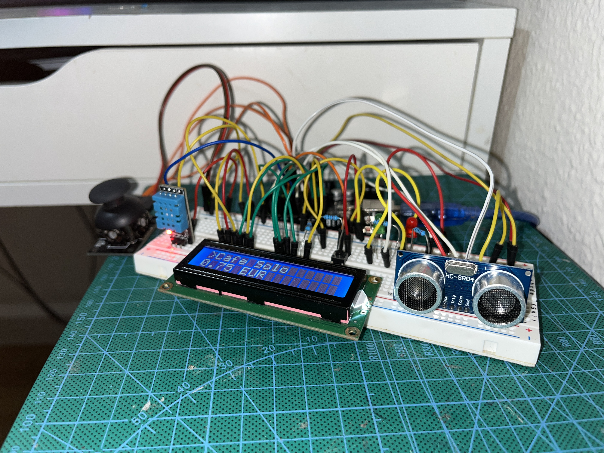
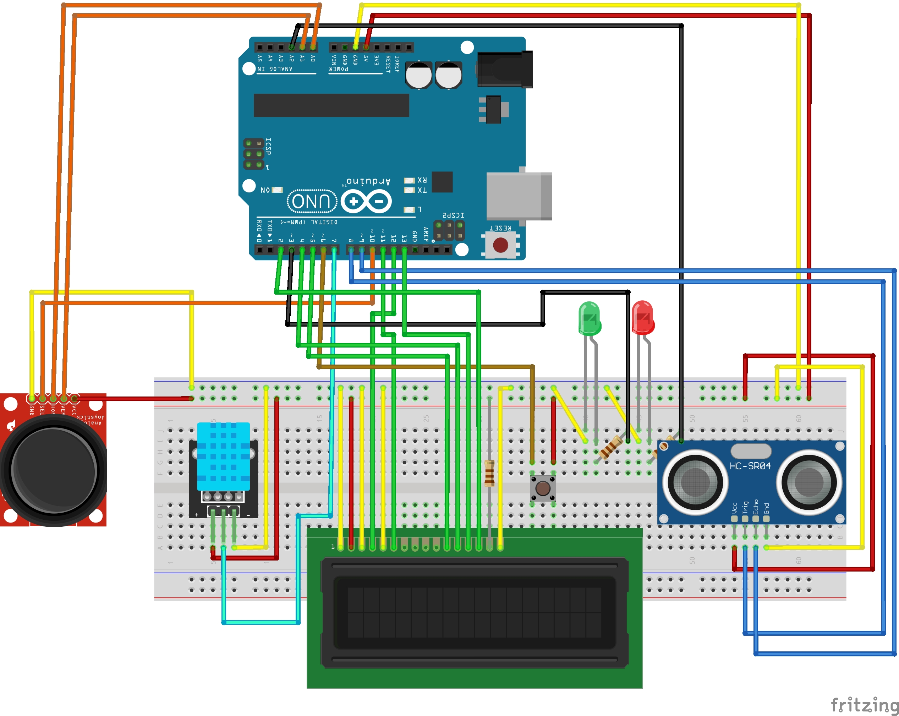

# Máquina de Café Inteligente con Arduino

## Descripción del Proyecto

Esta es la simulacion de una maquina de cafe inteligente, usando Arduino a la vez que sensores y actuadores. Su construccion es relativamente sencilla si se siguen las indicaciones de este post.

Se trata de una maquina con una interfaz de usuario muy intuitiva (user-friendly).
Desde el inicio el usuario recibira feedback constante del estado del programa que se mostrara en el display LCD incluido.

La luz del led rojo parpadeara 3 veces durante el arranque con intervalos de 1 segundo, mientras que en la pantalla LCD se mostrara el mensaje: "Cargando...".
Despues de esto el led se apagara y en la pantalla se mostrara el servicio de "Esperando cliente...".
Si detecta una persona delante de la maquina (a menos de 1m), la maquina pasara al segundo estado de servicio. Mostrara la informacion de temperatura ambiente y humedad durante 5 segundos, para despues listar los productos que contiene.
El usuario podra interactuar con esta lista haciendo uso del joystick incorporado(arriba/abajo). Para seleccionar el producto deseado, es tan sencillo como hacer click en el joystick.
Tras haber elegido un producto, el programa pasara al estado de preparacion de bebidas, durante el cual se mostrara un mensaje en la pantalla LCD: "Preparando Cafe..." por un tiempo aleatorio entre 4-8 segundos.
Al mismo tiempo el led secunadario verde se encendera de manera incremental, aumentando su intensidad en proporcion al tiempo de preparacion.
Tras esto la pantalla LCD mostrara el mensaje de: "Retirar bebida..." durante 3 segundos y volvera a la funcionalidad inicial del servicio (estado Servicio Activo).

En cualquier momento dentro de este estado el usuario podra resetearlo y volver al mensaje inicial de la temperatura y humedad haciendo uso del boton incorporado. Este se debe pulsar en un rango de 2-3 segundos.

Para acceder al modo admin usamos el mismo boton incorporado. Este se debe pulsar durante mas de 5 segundos para acceder al menu interactivo de administrador de la maquina.
En dicho menu observaremos una lista de nuevas funcionalidades que se mostraran en la pantalla LCD, al mismo tiempo que los dos leds incorporados se encenderan.
Para navegar por dicha lista usaremos el joystick de nuevo(arriba/abajo), permitiendo seleccionar la funcionalidad con el click y volver al menu(izquierda).

Para salir del modo Admin volveremos a pulsar el boton durante al menos 5 segundos.




---

## Características Principales

### Hardware Utilizado
- **Microcontrolador**: Arduino Elegoo UNO R3
- **Pantalla**: LCD 16x2
- **Sensores**:
  - DHT11 (temperatura y humedad)
  - Sensor ultrasónico HC-SR04 (detección de presencia)
- **Controles**:
  - Joystick analógico con botón
  - Botón adicional para funciones especiales
- **Indicadores**: 2 LEDs (estado y progreso)



### Funcionalidades del Sistema

#### Sistema de Estados Inteligente
- **Arranque**: Secuencia de inicialización con parpadeo de LEDs
- **Detección automática de clientes**: Usando sensor ultrasónico
- **Servicio activo**: Menú interactivo de productos
- **Preparación de bebidas**: Con indicador de progreso
- **Modo administrador**: Para configuración avanzada

#### Productos Disponibles
- Café Solo (€1.00)
- Café Cortado (€1.10)
- Café Doble (€1.25)
- Café Premium (€1.50)
- Chocolate (€2.00)

---

## Interfaz de Usuario

### Navegación con Joystick
- **Arriba/Abajo**: Navegar por menús y productos
- **Izquierda**: Retroceder en menús
- **Botón del joystick**: Seleccionar/Confirmar

### Controles con Botón Principal
- **Presión corta (1-2s)**: No hace nada
- **Presión media (2-3s)**: Reiniciar servicio
- **Presión larga (5s+)**: Entrar/Salir modo administrador

---

## Modo Administrador

El modo administrador permite acceso a:

### Ver Sensores
- **Temperatura y Humedad**: Lecturas en tiempo real del DHT11
- **Distancia**: Medición del sensor ultrasónico

### Configuración del Sistema
- **Contador de tiempo**: Tiempo de funcionamiento desde el arranque
- **Modificación de precios**: Ajuste dinámico de precios de productos

---

## Arquitectura del Software

### Sistema Multihilo
El código utiliza la librería `Thread` para gestionar múltiples tareas concurrentes:

- **Hilo de Arranque** (1000ms): Secuencia de inicialización
- **Hilo de Sensores** (500ms): Lectura de temperatura, humedad y distancia
- **Hilo de Interfaz** (50ms): Gestión de botones y joystick
- **Hilo de Preparación** (100ms): Control del proceso de preparación
- **Hilo de Admin** (200ms): Actualización del modo administrador

### Características de Seguridad
- **Watchdog Timer**: Reinicio automático en caso de cuelgue
- **Detección de rebotes**: Control preciso de botones
- **Estados protegidos**: Prevención de transiciones inválidas

---

## Instalación y Configuración

### Librerías Requeridas
```cpp
#include <LiquidCrystal.h>
#include <DHT.h>
#include <avr/wdt.h>
#include <Thread.h>
#include <ThreadController.h>
```

### Configuración de Pines
```cpp
// LCD
#define LCD_RS 12
#define LCD_EN 11
#define LCD_D4 5
#define LCD_D5 4
#define LCD_D6 13
#define LCD_D7 2

// Sensores
#define PIN_DHT 7
#define PIN_TRIG 8
#define PIN_ECHO 9

// Controles
#define JOYSTICK_X A0
#define JOYSTICK_Y A1
#define BOTON_JOYSTICK 10
#define PIN_BOTON 6

// LEDs
#define PIN_LED1 A2
#define PIN_LED2 3
```

---

## Funcionamiento

### Video Demostrativo
[url video del funcionamiento completo]

### Flujo de Operación

1. **Arranque del Sistema**
   - Inicialización de componentes
   - Secuencia de parpadeo de LEDs
   - Calibración de sensores

2. **Detección de Cliente**
   - El sensor ultrasónico detecta presencia (< 100cm)
   - Activación automática del servicio
   - Muestra temperatura y humedad inicial

3. **Selección de Producto**
   - Navegación con joystick
   - Visualización de precio en tiempo real
   - Confirmación con botón del joystick

4. **Preparación de Bebida**
   - Tiempo aleatorio de preparación (4-8 segundos)
   - Indicador LED con fade progresivo
   - Mensaje de "Retire bebida" al finalizar

---

## Personalización

### Modificar Productos
```cpp
Producto productos[5] = {
  {"Cafe Solo", 1.00},
  {"Cafe Cortado", 1.10},
  {"Cafe Doble" , 1.25},
  {"Cafe Premium" , 1.50},
  {"Chocolate" , 2.00}
};
```

### Ajustar Tiempos
- Tiempo de detección de cliente
- Duración de preparación
- Timeouts de pantalla

### Configurar Sensores
- Umbral de distancia para detección
- Intervalos de lectura de sensores
- Calibración de temperatura

---

## Referencias

-[URJC-AulaVirtual-Sistemas Empotrados y de tiempo real-2025-Practica 3-pdf](docs/Practica3.pdf)

-[Awesome README](https://github.com/matiassingers/awesome-readme)

-[Fritzing](https://fritzing.org)

---

*Desarrollado por @mtsj (Matias J. Mercado)*